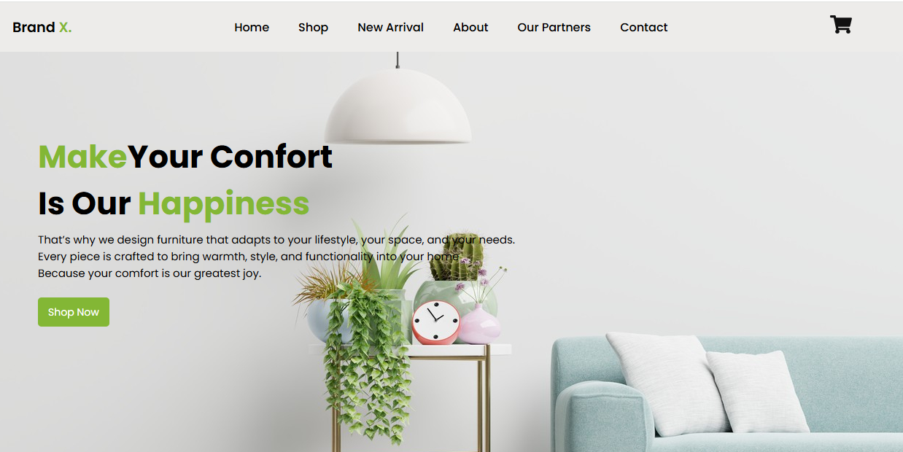

# 🛋️ Brand_X - Página Web de Muebles

**Brand_X** es una tienda online de muebles diseñada para ofrecer confort, estilo y funcionalidad a cualquier espacio. 
Este proyecto tiene como objetivo crear una experiencia web moderna, responsiva y atractiva donde los usuarios puedan 
conocer nuestros productos y valores como marca.

---

## 🌟 Características



- Página de inicio con mensaje de bienvenida y llamada a la acción.
- Sección "About Us" que comunica la filosofía de la marca.
- Catálogo de productos (muebles) con imágenes y descripciones.
- Carrito funcional para agregar y quitar productos, vaciar carrito.
- Diseño adaptable a dispositivos móviles (responsive design).
- Estilo visual limpio, moderno y enfocado en la experiencia del usuario.

  ---

## 🛠️ Tecnologías Utilizadas

- HTML5  
- CSS3  
- JavaScript

 ---

## 📁 Estructura del Proyecto
```
brand_x/
├── css/
│ └── spinner.css
│ └── style.css
├── images/
├── js/
│ └── carrito.js
│ └── main.js
│ └── menu.js
│ └── shop.js
├── index.html
└── README.md
```

---

## 🚀 Cómo Ejecutar el Proyecto

1. Clona el repositorio:
   ```bash
   https://github.com/YasminTorresDesign/Furniture-Website.git
2. Abre el archivo index.html en tu navegador.

---
   
## 🌐 Despliegue

Este proyecto ha sido desplegado con **GitHub Pages**, una herramienta gratuita para alojar sitios web estáticos directamente desde un repositorio de GitHub.

🔗 Puedes ver el sitio en línea aquí:  
https://yasmintorresdesign.github.io/Furniture-Website/

### 🚀 ¿Cómo lo desplegué?

1. Subí todo el proyecto a un repositorio de GitHub.
2. Entré a la pestaña **Settings** del repositorio.
3. En el menú lateral, seleccioné **Pages**.
4. En la sección **Source**, elegí la rama principal (por ejemplo, `main`) y la carpeta `/root` o `/docs`, según donde esté tu `index.html`.
5. Guardé los cambios y GitHub generó automáticamente el enlace del sitio.

### ✅ Recomendaciones

- Asegúrate de que tu archivo `index.html` esté en la raíz del repositorio o en la carpeta seleccionada en GitHub Pages.
- Si haces cambios en el código, solo tienes que hacer *push* a la rama y GitHub actualizará el sitio automáticamente.

---

## 🤝 Contribuciones

Si deseas aportar al proyecto con ideas, mejoras o correcciones, ¡eres bienvenido/a! Puedes hacer un fork o enviarme tus sugerencias por mensaje.

## 📬 Contacto

Para más información o colaboraciones, puedes escribirme a:
📧 yatorres.73@gmail.com


